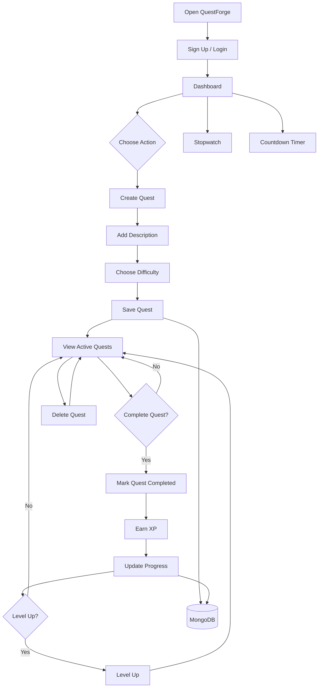

# IIT-Bhubaneshwar-web-Hackathon
Web Hackathon submission for IIT Bhubaneswar. Built with React + Vite, Tailwind CSS, Node.js + Express, and MongoDB. Deployed using Vercel and Render.


#  QuestForge

> Turn your real-life goals into quests, earn XP, track your progress, and level up.

QuestForge is a gamified productivity and personal growth application that transforms everyday tasks and goals into RPG-style quests.

Instead of simply maintaining a traditional to-do list, QuestForge lets users create quests, complete them, earn experience points (XP), and track their progress as they build better habits and accomplish their goals.

---

##  Live Demo

### QuestForge Website

https://iit-hackathon-i745.onrender.com
---

##  Features

-  User authentication
-  Create and manage quests
-  Add quest descriptions
-  Assign quest difficulty
-  Earn XP by completing quests
-  Mark quests as completed
-  Delete quests
-  Stopwatch timer
-  Countdown timer
-  Persistent data storage with Supabase
-  Deployed frontend and backend
-  Responsive and interactive interface

---

##  How QuestForge Works

QuestForge follows a simple RPG-inspired productivity system:

##  Application Workflow

## How QuestForge Works

QuestForge follows a simple RPG-inspired productivity system.


The goal is to make productivity more engaging by turning real-world activities into game-like challenges.


## Tech Stack

### Frontend

<p>
  
  
  
</p>

### Backend

<p>
  
  
</p>

### Database

<p>
  
</p>

### Deployment & Version Control

<p>
  
  
  
</p>

### Deployment

- Render
- GitHub

---

## Project Structure

```text
IIT-HACKATHON/
│
├── frontend/
│   ├── src/
│   │   ├── components/
│   │   ├── pages/
│   │   ├── hooks/
│   │   └── services/
│   ├── public/
│   ├── .env
│   ├── package.json
│   └── vite.config.js
│
├── backend/
│   ├── config/
│   ├── middleware/
│   ├── auth.js
│   ├── server.js
│   ├── package.json
│   └── .env
│
├── .gitignore
└── README.md
```
---

##  Local Installation

### 1. Clone the repository

```bash
git clone https://github.com/Mohit-web8516/IIT-HACKATHON.git
